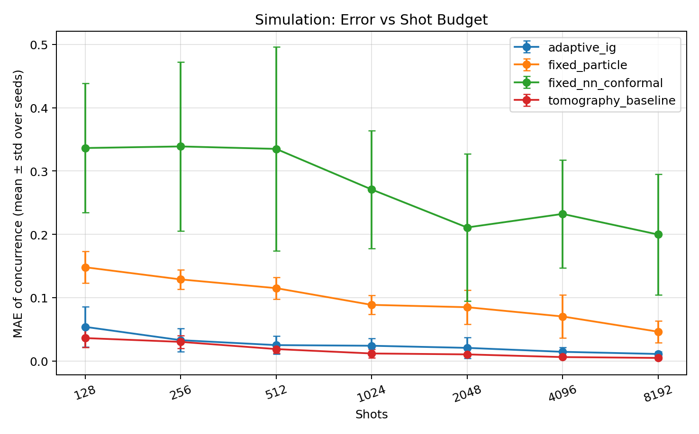
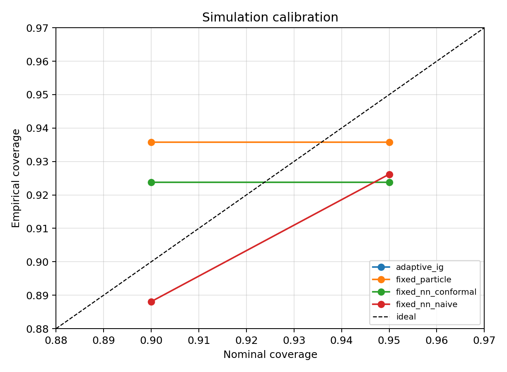
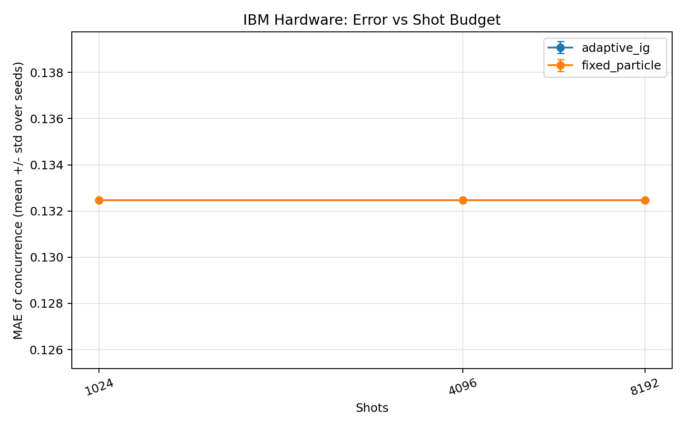
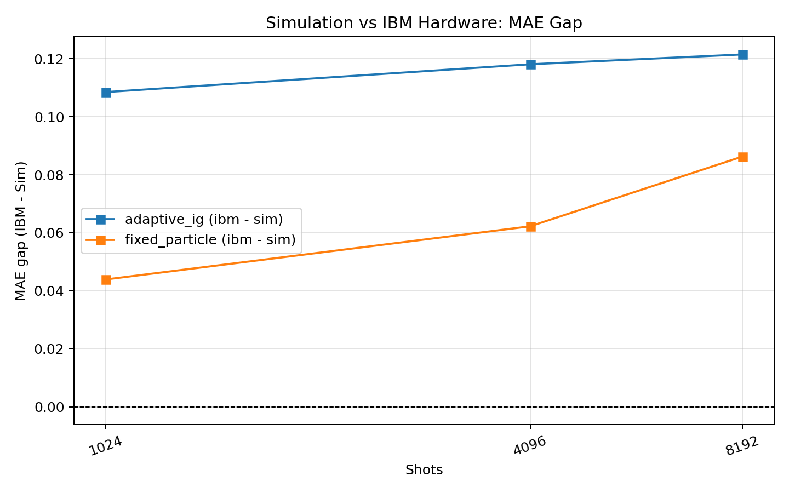

# Adaptive Weak-Measurement Entanglement Estimation on IBM Quantum Hardware

*Qubit-native weak measurement for two-qubit entanglement estimation with adaptive experiment design, conformal uncertainty quantification, and artifact-tracked IBM Quantum execution.*

[](./pyproject.toml)
[](https://qiskit.org/)
[](./LICENSE)



*Concurrence MAE versus shot budget across the 35-run simulation matrix. The adaptive information-gain policy reaches lower error at lower shot budgets than all fixed weak-design baselines.*

> **TL;DR** — This repo estimates two-qubit entanglement without full state tomography by compressing information into postselected weak-measurement statistics on a three-qubit circuit. It introduces a qubit-native ancilla-pointer realization of the 2024 photonic weak-value protocol, an adaptive experiment-design policy driven by expected information gain, and split/locally-scaled conformal prediction intervals for concurrence. Committed artifacts include a 35-run simulation sweep matrix, a queue-safe 18-config IBM hardware matrix on `ibm_torino`, tomography baselines, and full provenance files. The IBM aggregate validates the hardware execution stack with real counts, but its entanglement labels are still produced by a simulation-trained proxy predictor — the hardware section should be read with that scope in mind.

---

## Table of Contents

- [Overview](#overview)
- [Background](#background)
- [Mathematical Framework](#mathematical-framework)
- [What's New Here](#whats-new-here)
- [IBM Quantum Implementation](#ibm-quantum-implementation)
- [Results](#results)
- [Quickstart](#quickstart)
- [Execution Modes](#execution-modes)
- [Artifact Directory Layout](#artifact-directory-layout)
- [Project Structure](#project-structure)
- [Reproducibility](#reproducibility)
- [Interpretation](#interpretation)
- [Limitations](#limitations)
- [Roadmap](#roadmap)
- [References](#references)
- [Citation](#citation)
- [License](#license)
- [Contact](#contact)

---

## Overview

Quantifying two-qubit entanglement usually requires reconstructing a full density matrix and evaluating a nonlinear monotone such as concurrence. Even for a modest two-qubit system, that means repeated Pauli-basis acquisition, state reconstruction, and post-processing. This repository asks a more targeted question: for a structured state family, how much of that burden can weak-measurement-inspired local statistics and a carefully calibrated inference layer replace?

The experiment uses three qubits. Qubits `A` and `B` hold the target state; qubit `P` serves as a discrete pointer ancilla. A tunable interaction

$$
U(g)=\exp\!\left(-i\frac{g}{2}\,X_B \otimes Y_P\right)
$$

couples the system to the pointer. After a local compression step on `A`, the analysis postselects on `A = 0`, conditions on `B`, and extracts pointer-basis expectations that act as discrete analogs of weak-value quadratures. The resulting statistics are sufficient to identify the state parameters — and therefore the concurrence — for the benchmark family studied here.

Beyond this core measurement model, the repo contributes:

- a qubit-native ancilla-pointer construction that transpiles to IBM-compatible gate sets,
- a particle-based adaptive policy that selects measurement settings by expected information gain,
- split and locally-scaled conformal intervals for concurrence with explicit abstention,
- side-by-side simulation, tomography, and IBM artifact aggregation,
- and provenance files that make the run surface inspectable without reading the code.

The repository sits between a theory note, an experiment harness, and a research artifact package. It isn't a finalized paper release, but it's a serious, inspectable intermediate object.

---

## Background

### Weak measurement and entanglement

Weak measurement is attractive for entanglement estimation because it trades full state reconstruction for a smaller family of local, postselected statistics. In the original photonic protocol, weak values of a conditional local state were tied to density-matrix element ratios, and those ratios were mapped to concurrence for a benchmark class of mixed two-qubit states. The same logic drives this repo: local conditional information serves as a compressed surrogate for global entanglement information.

### From photonic pointers to qubit ancillas

The photonic antecedent encoded the pointer in continuous spatial distributions. This repository replaces that pointer with a qubit ancilla `P` and implements the weak interaction as a gate-model unitary on `B ⊗ P`. That substitution matters because it turns the protocol into something that can be simulated exactly, transpiled through Qiskit, and submitted to IBM Runtime — while preserving the qualitative logic of weak coupling, postselection, and conditional pointer readout.

### Concurrence and negativity

The primary target is concurrence `C`, since the benchmark family admits a clean algebraic bridge from weak-value ratios to the underlying state parameters. Negativity `N` is tracked as a secondary target through the partial transpose. Both are computed in [`src/metrics.py`](./src/metrics.py): concurrence via the standard spin-flip formula, negativity from the negative eigenvalues of ρ^{T_B}.

### Why adaptive design helps

Not all measurement settings are equally informative. The repo maintains a particle belief over the state parameters `(p, θ)` and selects settings by maximizing an information-gain score over candidate couplings and pointer bases. In the simulation sweep, this policy delivers the most visible efficiency gain: a fourfold median-shot advantage over the fixed-particle baseline for reaching a target concurrence error of 0.05.

### Why calibrated uncertainty matters on hardware

A point prediction alone isn't enough once postselection becomes sparse or hardware drift breaks the match between simulated and realized distributions. The conformal layer provides finite-sample marginal coverage under exchangeability, and the repo converts interval width and shift diagnostics into an abstention mechanism. On real hardware, knowing when the estimator should stop trusting itself matters as much as the estimate.

---

## Mathematical Framework

### Benchmark state family

The benchmark family used throughout the repository is

$$
\rho_{AB}(p,\theta)
=
p\lvert\psi_\theta\rangle\langle\psi_\theta\rvert
+
(1-p)\frac{I_A}{2}\otimes\rho_B^\theta,
\qquad
\lvert\psi_\theta\rangle
=
\cos\theta\lvert 00\rangle+\sin\theta\lvert 11\rangle,
$$

with $p \in [0,1]$ and $\theta \in [0, \pi/4]$. The parameter `p` controls the purity (and hence the entanglement), while `θ` sets the Schmidt coefficient balance. This family is rich enough to span separable-to-maximally-entangled states, yet structured enough that weak-measurement statistics can identify the parameters.

### Weak interaction and postselection

The pointer ancilla starts in $|0\rangle$, and the weak interaction is

$$
U(g)=\exp\!\left(-i\frac{g}{2}\,X_B\otimes Y_P\right).
$$

After applying $H_A$, the protocol postselects on $A = 0$, equivalent to postselection onto $|+\rangle$ in the original basis. The resulting conditional local state on `B` is

$$
\rho_B^{(+)}
=
\frac{\langle +|\rho_{AB}|+\rangle}
{\mathrm{Tr}(\langle +|\rho_{AB}|+\rangle)}.
$$

This conditional state is the object whose matrix elements encode the entanglement information.

### Pointer-basis features

From terminal counts over `(A, B, P)`, the code extracts postselection rates

$$
P(A{=}0,\,B{=}0), \qquad P(A{=}0,\,B{=}1),
$$

and conditional pointer expectations

$$
m_k^{(X)}=\mathbb{E}[(-1)^P \mid A{=}0,\,B{=}k,\;\text{pointer in }X],
$$

$$
m_k^{(Y)}=\mathbb{E}[(-1)^P \mid A{=}0,\,B{=}k,\;\text{pointer in }Y],
\qquad k\in\{0,1\}.
$$

These are the feature blocks assembled by [`aggregate_feature_vector`](./src/weak_measurement.py). Across a design grid, they form the representation consumed by both the neural-network baseline and the adaptive particle estimator.

### Identifiability

For the benchmark family, the conditional local state takes the closed form

$$
\rho_B^{(+)}
=
\begin{pmatrix}
\cos^2\theta & p\cos\theta\sin\theta \\
p\cos\theta\sin\theta & \sin^2\theta
\end{pmatrix},
$$

which yields weak-value-like ratios

$$
w_0=\frac{\rho_{10}}{\rho_{00}}=p\tan\theta,
\qquad
w_1=\frac{\rho_{01}}{\rho_{11}}=p\cot\theta.
$$

Inverting these gives

$$
p=\sqrt{w_0\,w_1},
\qquad
\tan^2\theta=\frac{w_0}{w_1}.
$$

So $(p, \theta)$ — and therefore concurrence — are identifiable from postselected weak information, up to expected boundary degeneracies. This algebraic fact is the core reason the benchmark family is a sensible testbed for compressed entanglement estimation.

### Design score and conformal intervals

Adaptive setting selection uses an information-gain score over the particle ensemble:

$$
\mathrm{IG}(s)=H\!\left(\sum_i w_i\,p(y\mid\vartheta_i,s)\right)-\sum_i w_i\,H\!\left(p(y\mid\vartheta_i,s)\right),
$$

where $\vartheta_i = (p_i, \theta_i)$ are particles and $s$ encodes the candidate coupling and pointer basis.

For uncertainty quantification, split conformal calibration computes residuals $r_i = |y_i - \hat{f}(x_i)|$ and produces intervals

$$
\hat{C}(x) \pm q_{1-\alpha},
$$

where $q_{1-\alpha}$ is the $\lceil(n_{\mathrm{cal}}+1)(1-\alpha)\rceil$-th order statistic of the calibration residuals. The locally-scaled variant replaces $r_i$ with $|y_i - \hat{f}(x_i)| / \hat{s}(x_i)$, yielding adaptive-width intervals. The repo also tracks negativity $\mathcal{N}(\rho) = \sum_{\lambda_i < 0} |\lambda_i(\rho^{T_B})|$ as a secondary entanglement summary.

---

## What's New Here

| Dimension | 2024 photonic antecedent | This repository |
| --- | --- | --- |
| Pointer | Continuous optical (spatial distributions) | Discrete qubit ancilla `P` |
| Hardware | Two-photon polarization | Superconducting qubits via Qiskit Aer + IBM Runtime |
| Design | Static acquisition + learned mapping | Fixed vs. adaptive information-gain selection over `g` and pointer basis |
| Output | Point prediction of concurrence | Point prediction + conformal intervals, abstention, shift diagnostics |
| Baselines | Photonic weak measurement + deep learning | Fixed NN, fixed particle, adaptive particle, tomography |
| Artifacts | Paper figures | Metrics CSVs, summaries, cached counts, raw run directories, manifests |

Two caveats are central. First, the IBM artifacts are real: the repo contains cached circuit counts, job metadata, backend listings, and per-configuration raw directories from `ibm_torino`. Second, the current IBM aggregate doesn't yet perform a full hardware-conditioned entanglement fit from those counts. The hardware scripts feed real counts into the execution stack and shift diagnostics, while the reported `c_hat` and `n_hat` values are inherited from a simulation-trained proxy model. That distinction is visible in [`scripts/run_ibm_matrix.py`](./scripts/run_ibm_matrix.py), [`scripts/aggregate_ibm_artifacts.py`](./scripts/aggregate_ibm_artifacts.py), and [`src/main.py`](./src/main.py).

---

## IBM Quantum Implementation

### Circuit architecture

```text
A: q0  ── state prep ── H ──────────────────────────── M_A

B: q1  ── state prep ──*── R_y(ϕ_B)? ───────────────── M_B
                        │
P: q2  ── |0⟩ ──────── U(g) ── basis(X/Y/Z) ────────── M_P

U(g) = exp(−i g X_B ⊗ Y_P / 2)

Transpilation-friendly decomposition:
  H(B) → Rx(−π/2, P) → CX(B, P) → RZ(g, P) → CX(B, P) → H(B) → Rx(+π/2, P)
```

### Qubit roles

| Qubit | Role |
| --- | --- |
| `A` | Compression / postselection. After $H_A$, keeping $A = 0$ projects onto $\lvert+\rangle$ in the original basis. |
| `B` | Target system qubit whose conditional local state carries the entanglement-relevant information. |
| `P` | Pointer ancilla. Initialized in $\lvert 0\rangle$, measured after an $X$, $Y$, or $Z$ basis rotation. |

### Coupling grid

The coupling parameter `g` controls the interaction strength between `B` and `P`. The simulation matrix sweeps

```text
g ∈ {0.00, 0.10, 0.20, 0.35, 0.50, 0.70, 0.90}
```

while the IBM matrix uses the queue-safe subset `{0.10, 0.35, 0.50}`. The repo treats `g = 0` as a no-information limit check and `g → π/2` as a strong-coupling check in [`tests/test_theory_limits.py`](./tests/test_theory_limits.py).

### Pointer basis choices

| Basis | Pre-measurement rotation |
| --- | --- |
| `Z` | None |
| `X` | $H$ on `P` |
| `Y` | $S^\dagger$ then $H$ on `P` |

The adaptive and fixed candidate settings are built over `X` and `Y` pointer bases by default; `Z` is supported in feature extraction but isn't part of the standard candidate grid.

### From counts to features

Counts are acquired over the classical bit order `(A, B, P)`. The feature layer computes postselection rates, conditional pointer expectations $m_k^{(X)}$ and $m_k^{(Y)}$, validity flags for bins where postselection mass vanishes, and a shift score from the KL divergence between observed and ideal per-setting outcome distributions. These features are what the fixed NN baseline and the adaptive particle estimator consume.

---

## Results

### Experiment families

| Family | Scope | Primary artifacts | Start here |
| --- | --- | --- | --- |
| Single-run output | Latest `python -m src.main` execution | [`artifacts/metrics.csv`](./artifacts/metrics.csv), [`artifacts/summary.md`](./artifacts/summary.md) | Smoke tests and local debugging |
| Simulation matrix | 35 runs (5 seeds × 7 shot budgets) | [`artifacts/metrics_sim.csv`](./artifacts/metrics_sim.csv), [`artifacts/summary_sim.md`](./artifacts/summary_sim.md) | **Main quantitative benchmark** |
| IBM hardware matrix | 18 configs (3 seeds × 3 shots × 2 policies) on `ibm_torino` | [`artifacts/metrics_ibm.csv`](./artifacts/metrics_ibm.csv), [`artifacts/summary_ibm.md`](./artifacts/summary_ibm.md) | Hardware execution and provenance |

### Headline numbers

| Dataset | Method | MAE(C) | RMSE(C) | Cov90 | Cov95 | Notes |
| --- | --- | ---: | ---: | ---: | ---: | --- |
| Simulation | `adaptive_ig` | 0.0259 | 0.0493 | 0.976 | 0.976 | 420 test rows across 35 runs |
| Simulation | `fixed_particle` | 0.0974 | 0.1489 | 0.936 | 0.936 | Non-adaptive particle baseline |
| Simulation | `fixed_nn_conformal` | 0.2748 | 0.3769 | 0.924 | 0.924 | Fixed weak-design NN regressor |
| Simulation | `tomography_baseline` | 0.0168 | 0.0309 | 0.371 | 0.371 | Strong point estimator; coverage is a degenerate placeholder |
| IBM | `adaptive_ig` | 0.1325 | 0.1778 | 0.833 | 0.833 | Hardware counts, proxy-based labels |
| IBM | `fixed_particle` | 0.1325 | 0.1778 | 0.833 | 0.833 | Same proxy labels, hence identical numbers |

### Key takeaways

- **Sample efficiency:** The adaptive policy reaches $|\hat{C} - C| \leq 0.05$ at a median threshold of 128 shots versus 512 for the fixed-particle baseline — a 4× advantage.
- **Calibration:** Conformal intervals are conservative for the adaptive methods, with both Cov90 and Cov95 landing at 0.976 in the simulation aggregate.
- **IBM caveat:** The hardware sample-efficiency ratio is currently 1.00, but that number inherits the proxy-based labeling pipeline and shouldn't be over-interpreted as a final hardware verdict.

### Figures


*Simulation aggregate: concurrence MAE versus shot budget for adaptive, fixed-particle, fixed-NN, and tomography methods.*


*Simulation aggregate: empirical versus nominal coverage for the conformal variants.*


*IBM aggregate: hardware MAE versus shot budget on `ibm_torino`. Real hardware counts, proxy-based entanglement predictions.*


*IBM − simulation MAE gap across the aggregate pipeline.*

Additional single-run diagnostics (from the most recent one-off sweep, not the full matrix):

- [`artifacts/fig_sample_efficiency.png`](./artifacts/fig_sample_efficiency.png)
- [`artifacts/fig_shift_abstention.png`](./artifacts/fig_shift_abstention.png)
- [`artifacts/fig_calibration.png`](./artifacts/fig_calibration.png)
- [`artifacts/fig_error_comparison.png`](./artifacts/fig_error_comparison.png)

### Reviewer notes

- [`artifacts/summary_sim.md`](./artifacts/summary_sim.md) and [`artifacts/summary_ibm.md`](./artifacts/summary_ibm.md) are the headline summaries.
- [`artifacts/run_manifest.json`](./artifacts/run_manifest.json) records aggregation commands, environments, and output lists.
- [`artifacts/claims_map.json`](./artifacts/claims_map.json) contains evidence pointers, though one hardware entry still reflects an earlier failed Qiskit-missing attempt. The later `ibm_torino` matrix is better represented by the summary and manifest files.

---

## Quickstart

### Setup

```bash
python -m venv .venv
source .venv/bin/activate
pip install -e .
```

### Single simulation sweep

```bash
python -m src.main \
  --mode sweep \
  --backend sim \
  --noise ideal \
  --policy adaptive \
  --g_grid 0.00,0.10,0.20,0.35,0.50,0.70,0.90 \
  --shots 2000 \
  --seed 7 \
  --export_dir artifacts
```

Writes `metrics.csv`, `summary.md`, and `fig_*.png` to `artifacts/`.

### Full simulation matrix

```bash
python scripts/run_sim_matrix.py
python scripts/aggregate_sim_artifacts.py
```

Generates the committed headline simulation artifacts: `metrics_sim.csv`, `summary_sim.md`, and the aggregate figures.

### IBM hardware (dry run)

```bash
python -m src.main \
  --mode hardware_run \
  --backend ibm \
  --ibm_backend_name ibm_kyoto \
  --policy adaptive \
  --g_grid 0.10,0.35,0.50 \
  --shots 1024 \
  --seed 0 \
  --dry_run \
  --export_dir artifacts/raw/ibm_runs/adaptive_s0_sh1024
```

Prints circuit summaries and writes `ibm_jobs.json` metadata without submitting jobs.

### IBM hardware (live execution)

```bash
export QISKIT_IBM_TOKEN="YOUR_IBM_QUANTUM_TOKEN"
python scripts/run_ibm_matrix.py
python scripts/aggregate_ibm_artifacts.py
```

The matrix runner prefers `ibm_torino` and falls back to `ibm_fez` or `ibm_marrakesh`. Per-config raw directories land under `artifacts/raw/ibm_runs/`; aggregated hardware artifacts go to `artifacts/`.

### Tests

```bash
pip install -e '.[dev]'
python -m pytest
```

The test suite contains nine checks, including zero-coupling and strong-coupling limit tests plus tomography reconstruction sanity.

---

## Execution Modes

The CLI in [`src/main.py`](./src/main.py) exposes four modes:

| Mode | What it does |
| --- | --- |
| `sweep` | Full simulation pipeline: fixed NN baseline, adaptive and fixed particle estimators, tomography baseline, calibration plots, summary files |
| `train` | Same pipeline as `sweep`, labeled as a training run in metadata |
| `eval` | Same pipeline as `sweep`, labeled as an evaluation run |
| `hardware_run` | Executes weak-measurement circuits on IBM hardware (or dry-run), caches counts, emits hardware summary via the proxy prediction path |

Three companion scripts orchestrate multi-run experiments:

- [`scripts/run_sim_matrix.py`](./scripts/run_sim_matrix.py) — 35-run simulation matrix
- [`scripts/run_ibm_matrix.py`](./scripts/run_ibm_matrix.py) — 18-config IBM matrix
- [`scripts/aggregate_sim_artifacts.py`](./scripts/aggregate_sim_artifacts.py) and [`scripts/aggregate_ibm_artifacts.py`](./scripts/aggregate_ibm_artifacts.py) — consolidation into headline CSVs, summaries, and figures

---

## Artifact Directory Layout

The artifact tree is intentionally redundant: both per-run raw directories and aggregate top-level summaries are kept.

| Path | Contents |
| --- | --- |
| `artifacts/metrics.csv` | Latest one-off `src.main` run |
| `artifacts/summary.md` | Markdown summary for that run |
| `artifacts/metrics_sim.csv` | Aggregated simulation matrix (35 sweeps) |
| `artifacts/summary_sim.md` | Headline simulation summary |
| `artifacts/metrics_ibm.csv` | Aggregated IBM matrix (18 configs) |
| `artifacts/summary_ibm.md` | Headline IBM hardware summary |
| `artifacts/claims_map.json` | Claim-to-evidence map |
| `artifacts/run_manifest.json` | Command and environment provenance |
| `artifacts/ibm_cache/ibm_jobs.json` | Public aggregate IBM job manifest |

Note: the root `artifacts/` directory contains both aggregate outputs and last-run outputs, so not every file there has the same evidentiary status. Local execution also creates raw caches under `artifacts/raw/`, but those run-by-run directories are not part of the published repository snapshot.

---

## Project Structure

```text
ibmq-weakmeasurement-entanglement/
├── artifacts/
│   ├── metrics.csv                  # Latest one-off sweep
│   ├── metrics_sim.csv              # Simulation aggregate
│   ├── metrics_ibm.csv              # IBM aggregate
│   ├── summary.md / summary_sim.md / summary_ibm.md
│   ├── run_manifest.json            # Provenance metadata
│   ├── claims_map.json              # Claim-to-evidence map
│   └── ibm_cache/                   # Public IBM job manifest
├── docs/
│   └── theory.md                    # Technical background and assumptions
├── notebooks/
│   └── walkthrough.ipynb            # Interactive walkthrough
├── scripts/
│   ├── run_sim_matrix.py
│   ├── aggregate_sim_artifacts.py
│   ├── run_ibm_matrix.py
│   └── aggregate_ibm_artifacts.py
├── src/
│   ├── main.py                      # CLI entry point
│   ├── design.py                    # Particle belief and adaptive design
│   ├── weak_measurement.py          # Exact probabilities and features
│   ├── circuits.py                  # Qiskit circuit construction
│   ├── metrics.py                   # Concurrence, negativity, tomography
│   ├── data.py                      # Benchmark state family
│   ├── models.py                    # NN regressor and conformal layer
│   ├── ibm_backend.py               # Runtime / Aer execution and caching
│   └── viz.py                       # Plotting
├── tests/
│   ├── test_basic.py
│   ├── test_sanity.py
│   └── test_theory_limits.py
├── LICENSE
├── pyproject.toml
└── README.md
```

---

## Reproducibility

### Simulation determinism

- `seed_all()` fixes Python, NumPy, and Torch seeds.
- The benchmark dataset is generated deterministically via `build_paper_anchor_dataset`.
- Adaptive tie-breaks are deterministic: information gain, then smaller `g`, then basis order.
- The simulation matrix uses seeds `{0, 1, 2, 3, 4}`, shots `{128, 256, 512, 1024, 2048, 4096, 8192}`, `g_grid = {0.0, 0.1, 0.2, 0.35, 0.5, 0.7, 0.9}`, and `n_train=40, n_cal=10, n_test=12, rounds=6`.

### Hardware nondeterminism

IBM execution is inherently nondeterministic: queueing, calibration drift, and transient backend conditions change run-to-run. To make results tractable, transpiled circuits are hashed and their counts cached under `artifacts/ibm_cache/` and per-run directories. The committed hardware manifest records 2,052 IBM job IDs on `ibm_torino`.

### Reproduction commands

```bash
# Simulation headline artifacts
python scripts/run_sim_matrix.py
python scripts/aggregate_sim_artifacts.py

# IBM headline artifacts (requires QISKIT_IBM_TOKEN)
export QISKIT_IBM_TOKEN="YOUR_IBM_QUANTUM_TOKEN"
python scripts/run_ibm_matrix.py
python scripts/aggregate_ibm_artifacts.py

# Tests
python -m pytest
```

### Provenance files

- [`artifacts/run_manifest.json`](./artifacts/run_manifest.json)
- [`artifacts/summary_sim.md`](./artifacts/summary_sim.md) / [`artifacts/summary_ibm.md`](./artifacts/summary_ibm.md)
- [`artifacts/ibm_cache/ibm_jobs.json`](./artifacts/ibm_cache/ibm_jobs.json)
- Raw run directories under `artifacts/raw/` are generated locally during execution and are not part of the published repository snapshot.

---

## Interpretation

The simulation aggregate supports the core claim: the adaptive particle policy is materially more sample-efficient than the fixed-particle baseline while preserving conservative empirical coverage across the benchmark family.

The conformal layer is doing real work. In simulation, the adaptive intervals are wider than a naive point estimate but remain well-calibrated — exactly the tradeoff the repo is designed to expose. Tomography remains a strong point estimator in this benchmark, but its interval columns are degenerate placeholders, not calibrated uncertainty statements.

The IBM artifact layer demonstrates something nontrivial: the qubit-native weak-measurement circuits transpile, submit, cache, and aggregate cleanly on superconducting hardware. What it doesn't yet demonstrate is a final end-to-end hardware-conditioned entanglement regressor. The current `c_hat` values are proxy predictions inherited from simulation. Closing that gap is the most important next step.

---

## Limitations

- The benchmark family is restricted to $\rho_{AB}(p, \theta) = p\,|\psi_\theta\rangle\langle\psi_\theta| + (1-p)\,I_A/2 \otimes \rho_B^\theta$. The identifiability argument is family-specific and doesn't extend to arbitrary mixed two-qubit states.
- Split conformal validity relies on exchangeability between calibration and test distributions.
- Postselection can become sparse, making conditional pointer moments noisy or undefined in low-mass bins.
- The hardware aggregate uses a simulation-trained proxy for `c_hat` and `n_hat`; the aggregate IBM shift reconstruction includes a placeholder approximation in [`scripts/aggregate_ibm_artifacts.py`](./scripts/aggregate_ibm_artifacts.py). Hardware coverage and sample-efficiency numbers should be read as provisional.
- The committed hardware matrix covers only 6 states per config, 3 shot budgets, and 3 coupling values.
- No `CITATION.cff`, project DOI, or committed manuscript yet exists.

---

## Roadmap

- Replace the IBM proxy path with a counts-conditioned hardware inference pipeline.
- Extend beyond the benchmark family to broader mixed-state ensembles.
- Add richer candidate-setting policies, including `ϕ_B` adaptation and OOD-aware design.
- Reconstruct hardware shift scores from per-setting cached counts rather than placeholders.
- Add refreshed calibration under hardware drift.
- Commit manuscript-facing assets: `CITATION.cff`, paper draft, archival release metadata.

---

## References

1. M. Yang, Y. Xiao, Z.-Y. Hao, Y.-W. Liao, J.-H. Cao, K. Sun, E.-H. Wang, Z.-H. Liu, Y. Shikano, J.-S. Xu, C.-F. Li, and G.-C. Guo, "Entanglement quantification via weak measurements assisted by deep learning," *Photonics Research* **12**(4), 712–719 (2024). [DOI: 10.1364/PRJ.498498](https://doi.org/10.1364/PRJ.498498)

2. W. K. Wootters, "Entanglement of Formation of an Arbitrary State of Two Qubits," *Phys. Rev. Lett.* **80**, 2245–2248 (1998). [DOI: 10.1103/PhysRevLett.80.2245](https://doi.org/10.1103/PhysRevLett.80.2245)

3. J. Lei, M. G'Sell, A. Rinaldo, R. J. Tibshirani, and L. Wasserman, "Distribution-Free Predictive Inference for Regression," [arXiv:1604.04173](https://arxiv.org/abs/1604.04173).

---

## Citation

Project-specific citation metadata (`CITATION.cff`, DOI, arXiv preprint) hasn't been committed yet. In the interim:

```text
Christopher Altman. ibmq-weakmeasurement-entanglement-active-design.
Software repository, version 0.1.0, 2026.
```

If citing results from this repository, include the accessed commit hash together with the photonic antecedent [1].

---

## License

MIT License. See [`LICENSE`](./LICENSE).

---

## Contact

- GitHub: [christopher-altman](https://github.com/christopher-altman)
- Website: [christopheraltman.com](https://www.christopheraltman.com)
- Google Scholar: [profile](https://scholar.google.com/citations?user=tvwpCcgAAAAJ)
- LinkedIn: [Altman](https://www.linkedin.com/in/Altman)

**Quick read path:** [`artifacts/summary_sim.md`](./artifacts/summary_sim.md) → [`artifacts/summary_ibm.md`](./artifacts/summary_ibm.md) → [`docs/theory.md`](./docs/theory.md)
